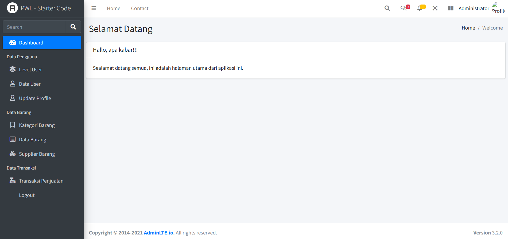
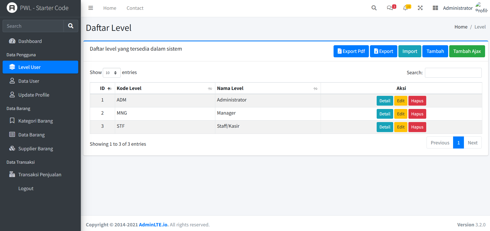
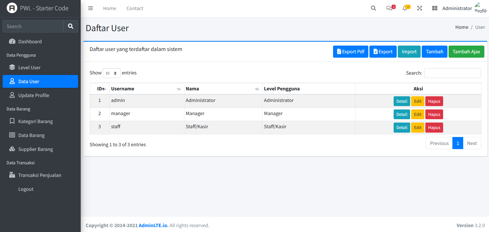
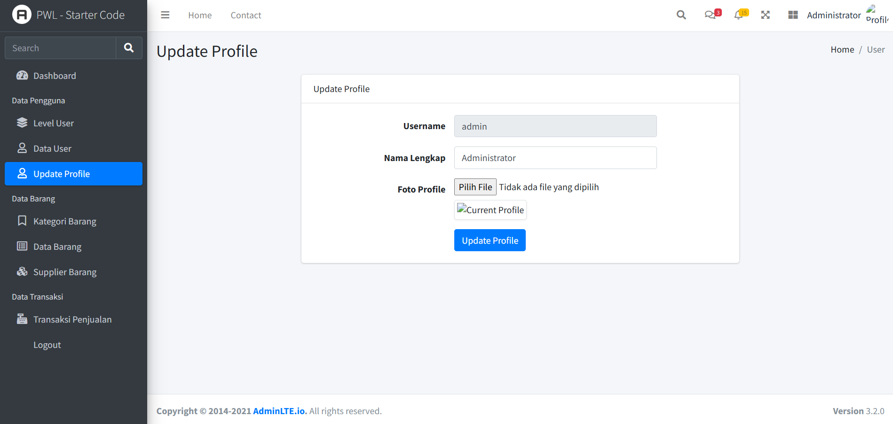
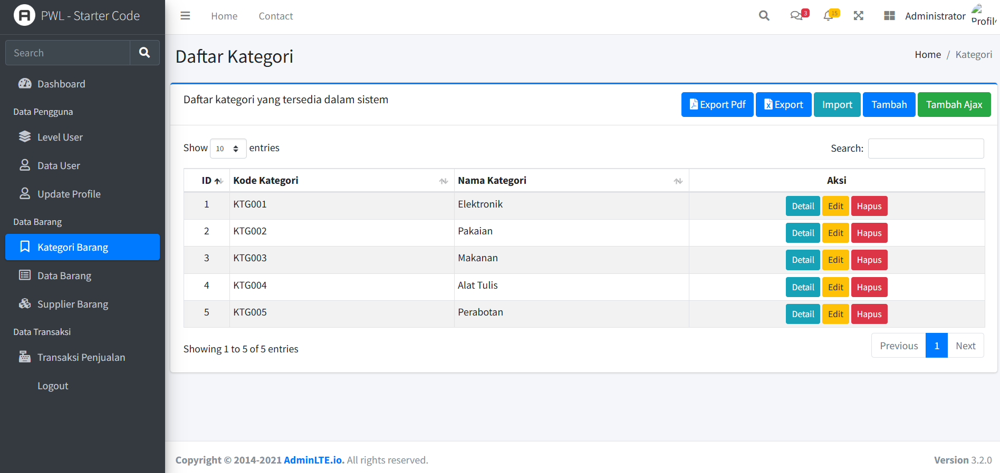
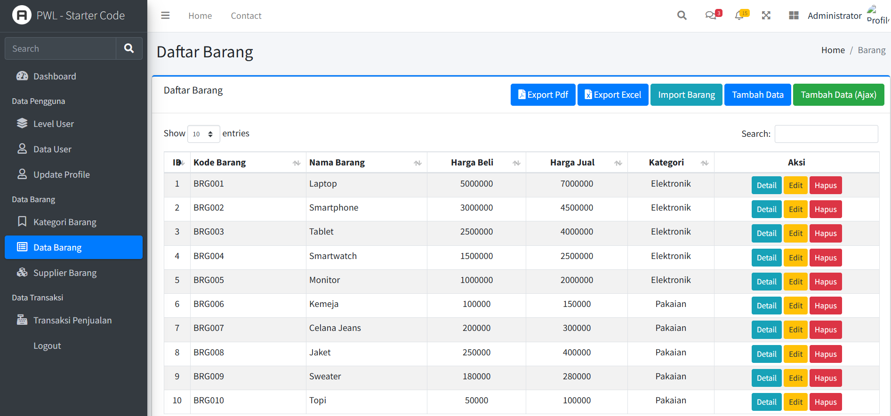
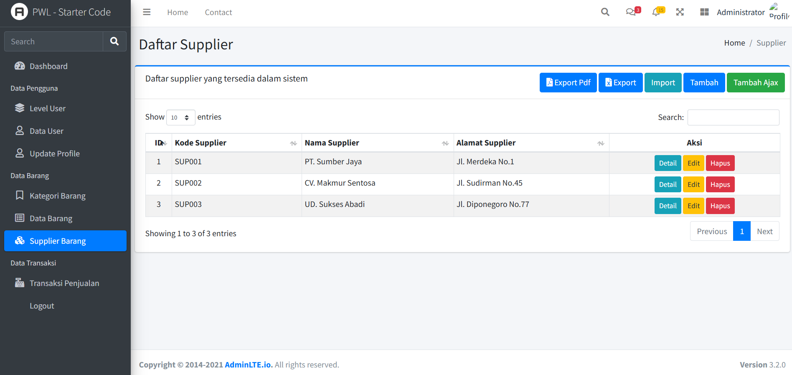

<div align="center">

```
██████╗  ██████╗ ███████╗    ████████╗██████╗  █████╗ ███╗   ██╗███████╗ █████╗  ██████╗████████╗██╗ ██████╗ ███╗   ██╗
██╔══██╗██╔═══██╗██╔════╝    ╚══██╔══╝██╔══██╗██╔══██╗████╗  ██║██╔════╝██╔══██╗██╔════╝╚══██╔══╝██║██╔═══██╗████╗  ██║
██████╔╝██║   ██║███████╗       ██║   ██████╔╝███████║██╔██╗ ██║███████╗███████║██║        ██║   ██║██║   ██║██╔██╗ ██║
██╔═══╝ ██║   ██║╚════██║       ██║   ██╔══██╗██╔══██║██║╚██╗██║╚════██║██╔══██║██║        ██║   ██║██║   ██║██║╚██╗██║
██║     ╚██████╔╝███████║       ██║   ██║  ██║██║  ██║██║ ╚████║███████║██║  ██║╚██████╗   ██║   ██║╚██████╔╝██║ ╚████║
╚═╝      ╚═════╝ ╚══════╝       ╚═╝   ╚═╝  ╚═╝╚═╝  ╚═╝╚═╝  ╚═══╝╚══════╝╚═╝  ╚═╝ ╚═════╝   ╚═╝   ╚═╝ ╚═════╝ ╚═╝  ╚═══╝
```

<br>


<br><br>

> **Sistem Point of Sale modern berbasis web — cepat, responsif, dan mudah digunakan.**  
> Dibangun dengan Laravel + AdminLTE untuk pengalaman kasir yang mulus dan manajemen toko yang efisien.

<br>

[](LICENSE)
[](CONTRIBUTING.md)
[](https://github.com/)

</div>

---

## 📋 Daftar Isi

- [✨ Tentang Proyek](#-tentang-proyek)
- [🎯 Fitur Utama](#-fitur-utama)
- [🖼️ Tampilan](#️-tampilan)
- [🛠️ Teknologi](#️-teknologi)
- [⚙️ Persyaratan Sistem](#️-persyaratan-sistem)
- [🚀 Instalasi](#-instalasi)
- [🔑 Konfigurasi](#-konfigurasi)
- [📂 Struktur Direktori](#-struktur-direktori)
- [👤 Akun Default](#-akun-default)
- [📖 Penggunaan](#-penggunaan)
- [🤝 Kontribusi](#-kontribusi)
- [📄 Lisensi](#-lisensi)

---

## ✨ Tentang Proyek

**POS Transaction** adalah aplikasi kasir berbasis web yang dirancang untuk membantu usaha kecil hingga menengah dalam mengelola transaksi penjualan secara digital. Dengan antarmuka yang bersih menggunakan **AdminLTE**, operator kasir dapat memproses transaksi dengan cepat, sementara pemilik toko mendapatkan laporan real-time yang komprehensif.

```
🛒  Proses transaksi → 🧾  Cetak struk → 📊  Lihat laporan → 💰  Kelola keuangan
```

---

## 🎯 Fitur Utama

### 🛍️ Transaksi & Kasir

| Fitur                | Keterangan                                  |
| -------------------- | ------------------------------------------- |
| 🔍 Pencarian Produk  | Cari produk cepat via nama atau barcode     |
| 🛒 Keranjang Belanja | Tambah, edit, hapus item secara real-time   |
| 💳 Multi Pembayaran  | Tunai, transfer, dan metode lainnya         |
| 🧾 Cetak Struk       | Struk termal / PDF otomatis                 |
| 🔄 Retur Transaksi   | Kembalikan item yang dikembalikan pelanggan |

### 📦 Manajemen Produk

| Fitur                | Keterangan                             |
| -------------------- | -------------------------------------- |
| 🏷️ Kategori & Produk | Kelola katalog produk dengan mudah     |
| 📈 Stok Otomatis     | Stok berkurang otomatis saat transaksi |
| ⚠️ Notifikasi Stok   | Peringatan saat stok mendekati minimum |
| 🖼️ Foto Produk       | Upload gambar untuk setiap produk      |

### 📊 Laporan & Analitik

| Fitur               | Keterangan                     |
| ------------------- | ------------------------------ |
| 📅 Laporan Harian   | Rekap transaksi per hari       |
| 📆 Laporan Bulanan  | Ringkasan pendapatan per bulan |
| 📉 Grafik Penjualan | Visualisasi data interaktif    |
| 📤 Export Data      | Export laporan ke PDF / Excel  |

### 👥 Manajemen Pengguna

| Fitur                | Keterangan                            |
| -------------------- | ------------------------------------- |
| 🔐 Role & Permission | Admin, Kasir, Supervisor              |
| 👤 Multi User        | Bisa digunakan banyak kasir sekaligus |
| 📝 Log Aktivitas     | Rekam semua aktivitas pengguna        |

---

## 🖼️ Tampilan Aplikasi

## 🖼️ Tampilan Aplikasi

### 📊 Dashboard

Halaman utama yang menampilkan ringkasan data sistem.


---

## 👤 Data Pengguna

### 🏷️ Level User

Manajemen level atau role pengguna dalam sistem.


### 👥 Data User

Menampilkan dan mengelola data pengguna.


### ✏️ Update Profile

Halaman untuk mengubah profil pengguna.


---

## 📦 Data Barang

### 🗂️ Kategori Barang

Mengelola kategori dari setiap barang.


### 📦 Data Barang

Menampilkan daftar barang yang tersedia.


### 🚚 Supplier Barang

Mengelola data supplier barang.


---

## 💰 Data Transaksi

### 🛒 Transaksi Penjualan

Melakukan transaksi penjualan barang.


### 📈 Laporan Penjualan

Melihat riwayat dan laporan transaksi penjualan.


---

## 🛠️ Teknologi

```
Backend          Frontend          Database         Tools
──────────       ────────          ────────         ─────
PHP 8.x          AdminLTE 3        MySQL / MariaDB  Composer
Laravel 10/11    Bootstrap 4       ────────         NPM / Vite
Eloquent ORM     jQuery            Storage          Git
Blade Template   FontAwesome       File Upload
```

---

## ⚙️ Persyaratan Sistem

Sebelum memulai, pastikan sistem kamu memenuhi persyaratan berikut:

```bash
PHP          >= 8.1
Composer     >= 2.x
Node.js      >= 16.x
NPM          >= 8.x
MySQL        >= 5.7  /  MariaDB >= 10.3
Laravel      >= 10.x
```

> 💡 **Tips:** Gunakan [Laragon](https://laragon.org/) (Windows) atau [Herd](https://herd.laravel.com/) (Mac) untuk setup lokal yang mudah.

---

## 🚀 Instalasi

Ikuti langkah-langkah berikut untuk menjalankan proyek di lokal:

### 1️⃣ Clone Repositori

```bash
git clone https://github.com/satriowisnuap/POS_Transact.git
cd pos-transaction
```

### 2️⃣ Install Dependensi PHP

```bash
composer install
```

### 3️⃣ Install Dependensi JavaScript

```bash
npm install
```

### 4️⃣ Salin File Environment

```bash
cp .env.example .env
```

### 5️⃣ Generate Application Key

```bash
php artisan key:generate
```

### 6️⃣ Konfigurasi Database

Edit file `.env` dan sesuaikan dengan database kamu:

```env
DB_CONNECTION=mysql
DB_HOST=127.0.0.1
DB_PORT=3306
DB_DATABASE=pos_transaction
DB_USERNAME=root
DB_PASSWORD=
```

### 7️⃣ Jalankan Migrasi & Seeder

```bash
# Buat tabel database
php artisan migrate

# Isi data awal (produk, user, kategori)
php artisan db:seed

# Atau sekaligus (fresh install)
php artisan migrate:fresh --seed
```

### 8️⃣ Build Assets Frontend

```bash
# Development
npm run dev

# Production
npm run build
```

### 9️⃣ Buat Storage Link

```bash
php artisan storage:link
```

### 🔟 Jalankan Server

```bash
php artisan serve
```

🎉 **Aplikasi berjalan di:** `http://localhost:8000`

---

## 🔑 Konfigurasi

### Pengaturan Toko

Sesuaikan informasi toko di file `.env`:

```env
APP_NAME="Nama Toko Kamu"
APP_URL=http://localhost:8000

# Konfigurasi Mail (untuk notifikasi)
MAIL_MAILER=smtp
MAIL_HOST=smtp.gmail.com
MAIL_PORT=587
MAIL_USERNAME=email@toko.com
MAIL_PASSWORD=your_password

# Timezone
APP_TIMEZONE=Asia/Jakarta
```

### Konfigurasi Struk

Edit di `config/pos.php` (jika tersedia):

```php
'store_name'    => env('STORE_NAME', 'Toko Saya'),
'store_address' => env('STORE_ADDRESS', 'Jl. Contoh No. 1'),
'store_phone'   => env('STORE_PHONE', '08xxxxxxxxxx'),
'receipt_footer'=> env('RECEIPT_FOOTER', 'Terima kasih telah berbelanja!'),
```

---

## 📂 Struktur Direktori

```
pos-transaction/
│
├── 📁 app/
│   ├── 📁 Http/
│   │   ├── 📁 Controllers/
│   │   │   ├── TransactionController.php   ← Logika kasir
│   │   │   ├── ProductController.php       ← Manajemen produk
│   │   │   ├── ReportController.php        ← Laporan
│   │   │   └── UserController.php          ← Pengguna
│   │   └── 📁 Middleware/
│   └── 📁 Models/
│       ├── Transaction.php
│       ├── Product.php
│       └── User.php
│
├── 📁 database/
│   ├── 📁 migrations/                      ← Struktur tabel
│   └── 📁 seeders/                         ← Data awal
│
├── 📁 public/
│   ├── 📁 adminlte/                        ← Assets AdminLTE
│   └── 📁 uploads/                         ← Foto produk
│
├── 📁 resources/
│   └── 📁 views/
│       ├── 📁 layouts/                     ← Template utama
│       ├── 📁 transactions/                ← Halaman kasir
│       ├── 📁 products/                    ← Halaman produk
│       └── 📁 reports/                     ← Halaman laporan
│
├── 📁 routes/
│   └── web.php                             ← Semua route
│
├── .env.example
├── composer.json
└── README.md
```

---

## 👤 Akun Default

Setelah menjalankan `php artisan db:seed`, gunakan akun berikut:

| Role         | Email           | Password   |
| ------------ | --------------- | ---------- |
| 👑 **Admin** | `admin@pos.com` | `password` |
| 🧑‍💼 **Kasir** | `kasir@pos.com` | `password` |

> ⚠️ **Penting:** Segera ganti password default setelah login pertama kali!

---

## 📖 Penggunaan

```

### 📊 Melihat Laporan (Admin)

```

Dashboard → Laporan → Pilih periode → Export PDF/Excel

```

### 📦 Tambah Produk Baru (Admin)

```

Produk → Tambah Produk → Isi form → Upload foto → Simpan

````

---

## 🤝 Kontribusi

Kontribusi sangat terbuka! Ikuti langkah berikut:

```bash
# 1. Fork repositori ini
# 2. Buat branch fitur baru
git checkout -b feature/nama-fitur

# 3. Commit perubahan kamu
git commit -m "feat: menambahkan fitur nama-fitur"

# 4. Push ke branch
git push origin feature/nama-fitur

# 5. Buat Pull Request
````

### 📐 Konvensi Commit

```
feat:     Fitur baru
fix:      Perbaikan bug
docs:     Perubahan dokumentasi
style:    Formatting, tanpa perubahan logika
refactor: Refactoring kode
test:     Menambah atau memperbaiki test
```

---

## 🐛 Melaporkan Bug

Temukan bug? Silakan buat [Issue baru](https://github.com/satriowisnuap/POS_Transact.git) dengan template:

```
**Deskripsi Bug:**
[Jelaskan apa yang terjadi]

**Langkah Reproduksi:**
1. Pergi ke '...'
2. Klik '...'
3. Lihat error

**Yang Diharapkan:**
[Jelaskan yang seharusnya terjadi]

**Screenshot:**
[Sertakan jika ada]

**Environment:**
- OS: [misal: Windows 11]
- Browser: [misal: Chrome 120]
- PHP: [misal: 8.2]
```

---

## ❓ FAQ

<details>
<summary><b>Gagal saat php artisan migrate?</b></summary>

Pastikan database sudah dibuat dan konfigurasi `.env` sudah benar. Coba:

```bash
php artisan config:clear
php artisan migrate
```

</details>

<details>
<summary><b>Foto produk tidak tampil?</b></summary>

Jalankan perintah berikut:

```bash
php artisan storage:link
```

</details>

<details>
<summary><b>Halaman AdminLTE tidak tampil dengan benar?</b></summary>

Build ulang assets:

```bash
npm install
npm run build
php artisan view:clear
```

</details>

<details>
<summary><b>Error 500 setelah deploy?</b></summary>

Jalankan urutan berikut:

```bash
php artisan config:cache
php artisan route:cache
php artisan view:cache
php artisan storage:link
chmod -R 775 storage bootstrap/cache
```

</details>

---

## 📄 Lisensi

Proyek ini dilisensikan di bawah **MIT License** — lihat file [LICENSE](LICENSE) untuk detail.

```
MIT License — bebas digunakan, dimodifikasi, dan didistribusikan
dengan tetap mencantumkan kredit kepada pembuat asli.
```

---

<div align="center">

Dibuat dengan ❤️ menggunakan **Laravel** & **AdminLTE**

⭐ **TerimaKasih** ⭐

<br>

[🔝 Kembali ke Atas](#)

</div>
